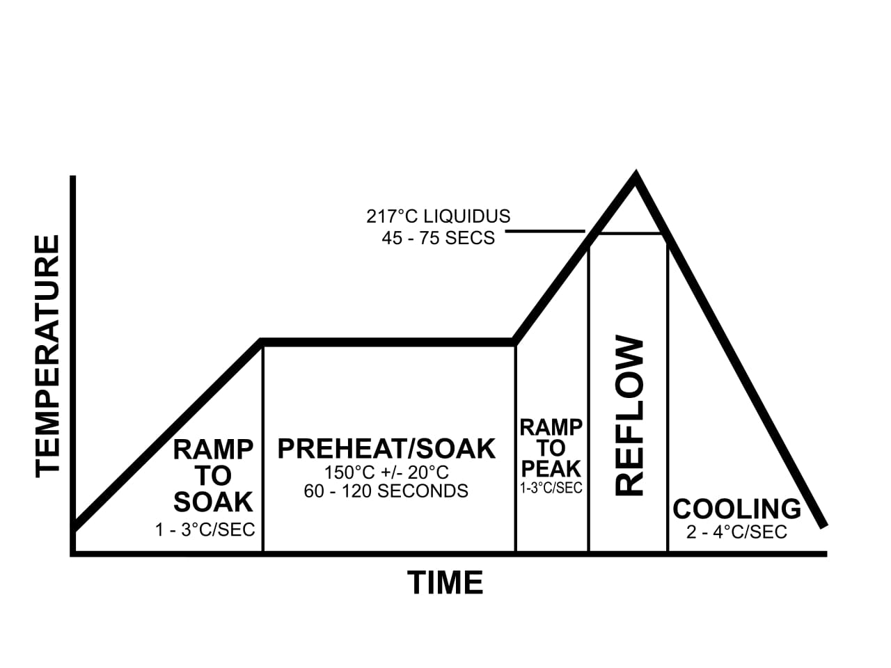

# reflowOvenController

## Introduction

The goal of this project was to design a reflow oven controller for a generic toaster oven that automates the soldering process for SMDs on PCBs. Using an N76E003 microcontroller programmed with Intel 8051 assembly, the system measures and regulates oven temperature with a K-type thermocouple and controls the oven through an SSR using PWM. The goal was to get the oven to follow a standard reflow profile by adjusting user-selectable settings such as soak temperature, soak time, reflow temperature, and reflow time. The system also includes real-time monitoring via an LCD and a Python script for plotting.

Example reflow profile:

https://en.wikipedia.org/wiki/Reflow_soldering

## Key Features

- **Assembly Language Firmware:** The microcontroller firmware is programmed in assembly language.

- **FSM:** Reflow state are controlled by finite state machine

- **Temperature Measurement:** Oven temperature is measured between 25°C and 240°C using a K-type thermocouple with cold junction compensation.

- **Oven Control:** A 1500W toaster oven is regulated via a solid-state relay (SSR) using PWM for power delivery.

- **User Interface:**

    Pushbuttons allow profile parameter selection.

    An LCD displays current temperature, elapsed time, and process state.

    Start/Stop buttons provide process control.

- **Real-Time Plotting:** Temperature readings are sent via serial port to a PC for live plotting with color-coded stages.

- **Process Summary:** Displays maximum temperature, slopes, averages, and time spent in each stage.

- **Multimeter Validation:** Simultaneously reads and compares thermocouple voltage from a second serial port, converting it to temperature to compare.

- **Data Export & Email:** Automatically saves temperature data (ADC and multimeter validation) to temperature_data.xlsx and emails the file if an address is provided.

- **Safety Shutdown:** The system automatically shuts down if the oven fails to reach 50°C within the first 60 seconds.

### One profile we were able to get with our controller:

